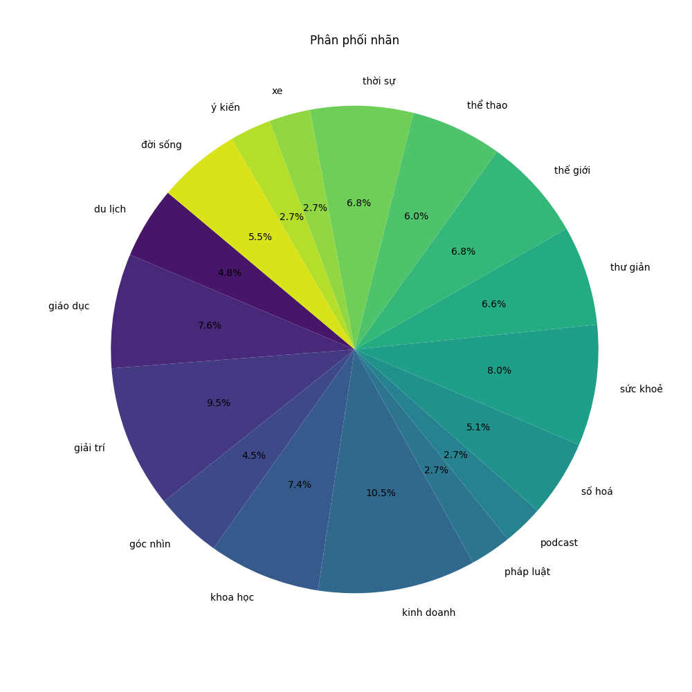
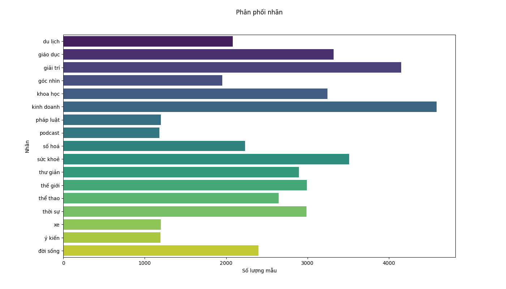
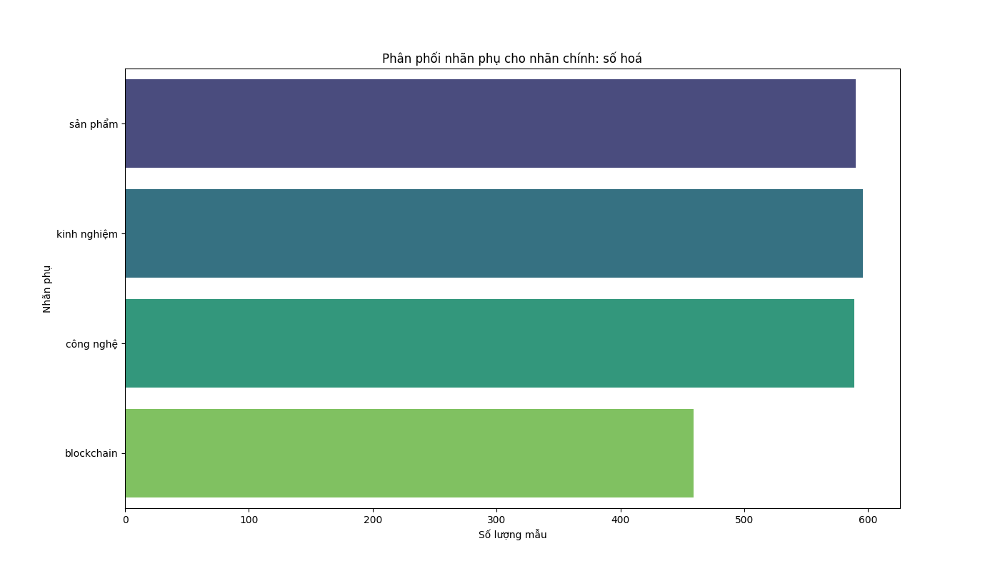
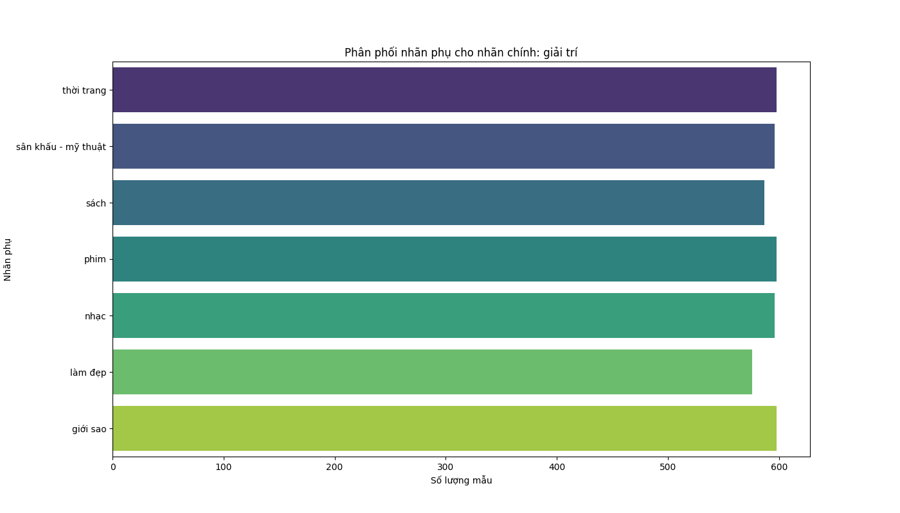
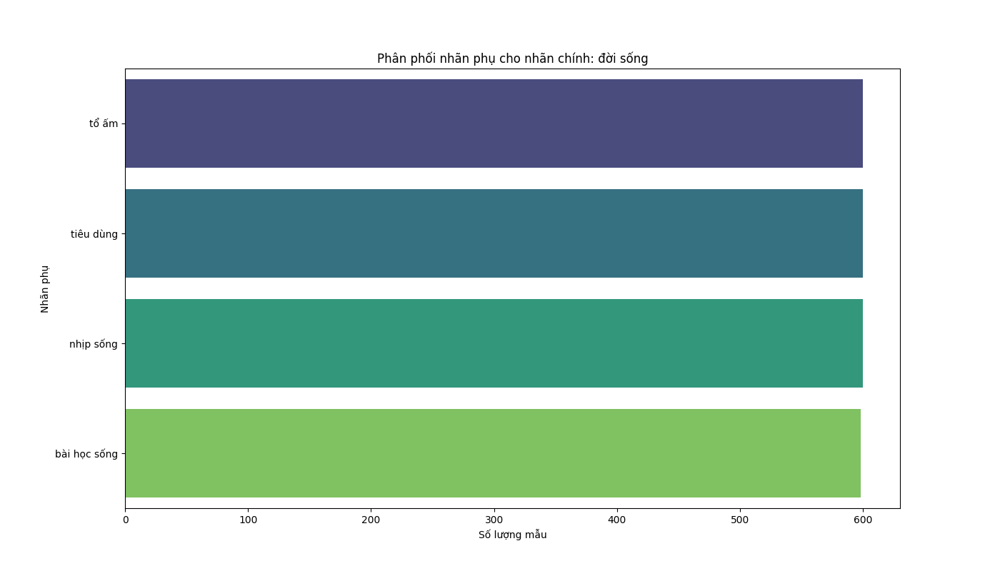
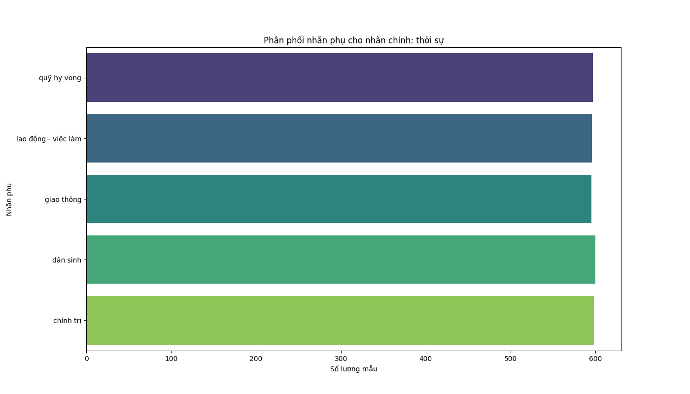
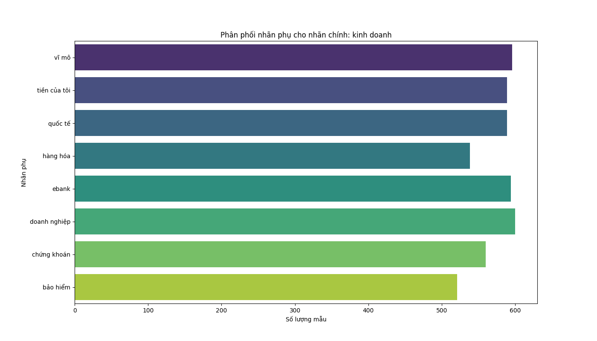

# Thống kê phân bố của dữ liệu

## Phân phối nhãn ở cấp độ 1

### Theo phần trăm

### Theo số lượng mẫu

## Phân phối nhãn ở cấp độ 2

### Phân phối của nhãn Xe

### Phân phối của nhãn Podcast

### Phân phối của nhãn Số hoá

### Phân phối của nhãn Giáo dục

### Phân phối của nhãn Giải trí

### Phân phối của nhãn Du lịch

### Phân phối của nhãn Thế giới

### Phân phối của nhãn Đời sống

### Phân phối của nhãn Thư giản

### Phân phối của nhãn Thời sự

### Phân phối của nhãn Pháp luật

### Phân phối của nhãn Thể thao

### Phân phối của nhãn Khoa học

### Phân phối của nhãn Sức khoẻ

### Phân phối của nhãn Kinh doanh

### Phân phối của nhãn Ý kiến

### Phân phối của nhãn Góc nhìn

